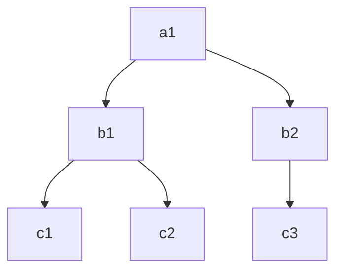
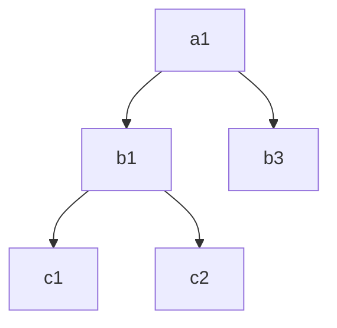

# Home interaction models

## game concepts

### Tree of life

Tree of life: the altar of Cult of the Lamb. A vital structure linked to Home level. It might issue requests either explicitly or through life-like and overall status.

It could even represent the explored areas of all potential Home ecosystems. The progression tree bound with the gameplay and it's own purpose.

The players want to unlock the whole tree.

## Dungeon animals

Animals within the dungeons that require help or taking care of. Could also be structures we need to repair. Both would provide us with new resources or unlock animals for our home.

Animals and resources allow us to change the ecosystem according to ecology ideas below.

## ecology

We could use overlaped trofic chains ( [modularity](https://twitter.com/rafabppinheiro/status/1176176367198724096)). Which will look like a very diverse ecosystem but it will mostly be three-level trofic systems.

[Food Web Dynamics Explorer](https://jjborrelli.shinyapps.io/FW_Dynamics/), a simulation focused on the food web connections. Might be too complex for the player to understand what's going on? Tends to stabilize at 7 species and it only has 2 trophic levels (prey-predator).

[Another simulator](https://github.com/danielriosgarza/SyntheticMicrobiome) on gut microbes can be ran locally with streamlit

[Movement of plankton](https://www.dashinggecko.com/post/2022-05-06-random-walk-animation/) based on random walks

[Model] that builds nested/compund producer-consumer topologies. It's based on the idea that mutation choosing between specialization or generalization leads to [nested](https://twitter.com/i/status/1176176025874644995) and [compound](https://twitter.com/i/status/1176176367198724096) topologies or a combination. It manages to replicate the topologies without needing the hyposthesis of preference of stable systems.

The [Generalized Lotka–Volterra equation (1930s)](https://en.wikipedia.org/wiki/Generalized_Lotka%E2%80%93Volterra_equation) might have been superseeded by [Generalized consumer resource model](https://en.wikipedia.org/wiki/Consumer%E2%80%93resource_interactions), may be [a topology model proposal](https://sci-hub.wf/10.1126/science.aaa6224)

Overviews on wikipedia [Population ecology](https://en.wikipedia.org/wiki/Population_ecology),

[A simplification of lotka-volterra?](https://en.wikipedia.org/wiki/Arditi%E2%80%93Ginzburg_equations), the speed of predators is proportional to the predator-prey ratio, aproximation that simplifies things apparently.

:rocket: [A classification of functional responses (trophic functions)](https://en.wikipedia.org/wiki/Functional_response) which looks ready to be programmed :P

I don't know if [Niche modelling](https://en.wikipedia.org/wiki/Species_distribution_modelling) is relevant. Maybe we could turn the whole idea around and instead of relying on resource consumption, rely on probability of living there given environment conditions to make the game decide if the species stays or not. [Introduction to Species Distribution Modelling](https://www.youtube.com/watch?v=1cQ0-ybVM6U).

On this line, biomathematics goes from mathematical and programatical models to reality, like a fractal tree. [A list](https://en.wikipedia.org/wiki/Mathematical_and_theoretical_biology) of those that we could explore.

# On immigration and trofic changes

Remember [Diversity, stability, and reproducibility in stochastically assembled microbial
ecosystems](https://arxiv.org/pdf/1711.00755.pdf)

Colonizer b3 arrives and has greater afinity to a1 by-products, marking the decline of b2 and consequentlly c3

Eventually c4 and c5 will arribe since b3 by-products exist. Meanwhile, new colonizers might come with weak afinity, making them die off or leave.

Players could artificially increase resources or decrease local animals to help colonizers establish in pro of game progression (which could be hinted via chore-requests given by dungeon animals or the tree of life.)

# Next steps

Code a estable trofic chain of 2 or 3 levels. Estability values can probably be computed using one of the previous models.

Make a decision about population sizes. Might change the approach to the previous models. Maybe in-game one individual might represent a cluster of individuals to use those models.